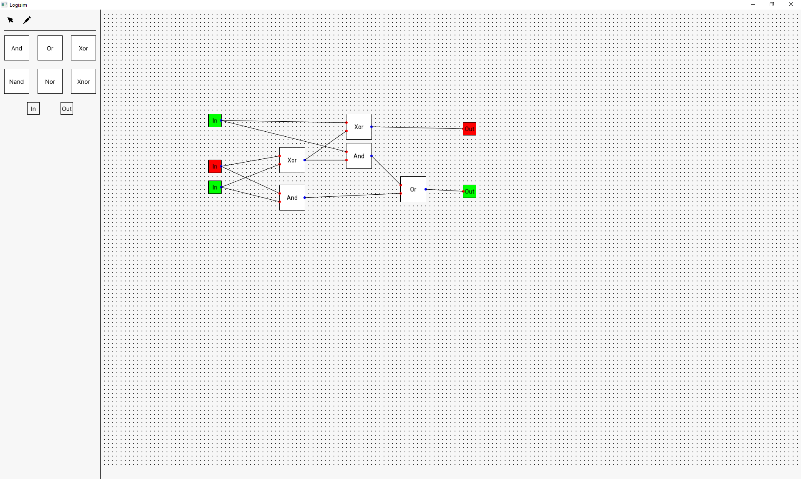

<picture>
 <source media="(prefers-color-scheme: dark)" srcset="[https://github.com/GiperB0la/Logisim/blob/main/Screen.png](https://github.com/GiperB0la/Logisim/blob/main/Screen.png)">
 <source media="(prefers-color-scheme: light)" srcset="YOUR-LIGHTMODE-IMAGE">
 
</picture>
